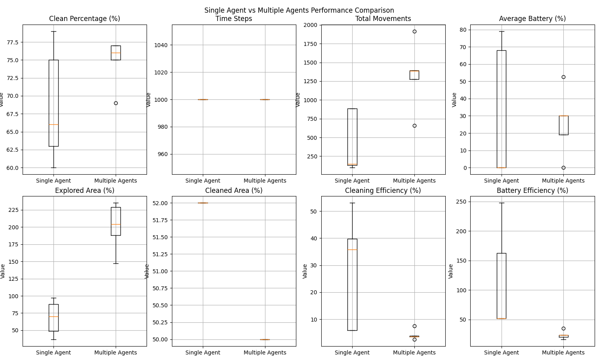

# Multi-Agent Roomba Cleaning Simulation Report

## Running the simulation

```bash
python main.py
```

## 1. Problem Statement and Solution Proposal

### Problem

- Efficient cleaning of spaces using autonomous robotic agents (Roombas)
- Challenges include:
  - Limited battery life
  - Unknown environment navigation
  - Obstacle avoidance
  - Finding optimal cleaning paths
  - Coordination between multiple agents

### Solution Proposal

- Implementation of an intelligent multi-agent system where each Roomba:
  - Explores and maps its environment
  - Maintains battery levels
  - Cleans dirty areas efficiently
  - Returns to charging stations when needed
  - Coordinates with other agents (in multi-agent scenarios)

## 2. Agent Design

### Objectives

- Primary: Clean all dirty cells in the environment
- Secondary: Maintain sufficient battery level
- Tertiary: Explore unknown areas

### Effector Capabilities

- Movement: Up, Down, Left, Right
- Cleaning: Clean dirty cells
- Charging: Recharge at charging stations

### Perception

- Knowledge Matrix (3x3 grid around agent)
- States perceived:
  - Clean cells
  - Dirty cells
  - Obstacles
  - Charging stations
  - Unknown areas

### Proactivity

- Autonomous decision making based on:
  - Battery level
  - Known dirty cells
  - Unexplored areas
  - Distance to charging station

### Performance Metrics

1. Cleaning Efficiency
   - Percentage of clean cells
   - Number of movements per clean cell
2. Battery Management
   - Average battery level
   - Charging frequency
3. Exploration
   - Percentage of explored cells
   - Time to full exploration

## 3. Subsumption Architecture

### Layer 1: Battery Management (Highest Priority)

- Monitor battery level
- Return to charging station when critical
- Charge until safe level reached

### Layer 2: Obstacle Avoidance

- Detect obstacles
- Calculate alternative paths
- Update knowledge matrix

### Layer 3: Cleaning Behavior

- Identify dirty cells
- Clean current location
- Plan path to nearest dirty cell

### Layer 4: Exploration (Lowest Priority)

- Map unknown areas
- Update environmental knowledge
- Choose exploration targets

## 4. Environment Characteristics

### Physical Properties

- Grid-based world (10x10 default)
- Discrete cell states
- Static obstacles
- Fixed charging stations

### Environment Properties

- Partially observable
- Deterministic
- Sequential
- Static
- Discrete

### Configurable Parameters

- Grid size
- Number of agents
- Initial dirty cell percentage
- Obstacle percentage
- Maximum time steps

## 5. Simulation Statistics Analysis

### Statistical Comparison Charts


*Figure 1: Performance metrics comparison between single and multiple agent configurations*

> **Note**  
> For accurate results, the simulation statistics will be collected and displayed only after stopping the visual simulation (Ctrl+C in terminal). This ensures all data is properly captured from complete simulation runs. The graphs and detailed statistical analysis will be generated automatically after the visual interface closes.

### Single Agent Performance

The single agent simulations showed interesting patterns across the 5 runs:

- Clean percentage averaged between 60-78%, with most runs achieving above 70%
- Battery management was a critical issue, with 4 out of 5 simulations ending with depleted batteries (0%)
- Exploration coverage varied significantly (51-97% of the environment)
- Cleaning efficiency improved as the agent learned, ranging from 5.86% to 57.14%
- Battery efficiency remained consistent at 52% for most runs, with one outlier at 96.30%

### Multi-Agent Performance (3 Agents)

The three-agent system demonstrated different characteristics:

- Clean percentage was more consistent, staying between 76-77%
- Total movements were significantly higher (1111-2446 moves)
- Battery levels showed high variability (0-63.33% final average)
- Exploration coverage was much higher (168-289% cumulative coverage)
- Cleaning efficiency was lower (2.04-4.50%) due to agent overlap
- Battery efficiency was generally lower (16.67-45.45%) due to increased coordination overhead

### Key Findings

1. **Consistency vs. Efficiency**
   - Single agents showed higher variability but better efficiency when successful
   - Multiple agents provided more consistent cleaning results but at lower efficiency

2. **Resource Usage**
   - Single agents were more prone to complete battery depletion
   - Multiple agents showed better battery management distribution but lower overall efficiency

3. **Coverage Patterns**
   - Multiple agents achieved higher cumulative exploration but with significant overlap
   - Single agents had more focused exploration patterns

4. **Performance Trade-offs**
   - Single agents: Higher efficiency but less consistent results
   - Multiple agents: More consistent results but lower efficiency due to coordination overhead

## 6. Conclusions

1. Performance Analysis
   - Single agent achieves clean percentages between 60-78%, showing good individual coverage
   - Multi-agent system (3 agents) maintains more consistent cleaning (76-77%) but with higher resource usage
   - Battery management is critical; single agents often deplete batteries while multiple agents distribute the load better

2. Efficiency Trade-offs
   - Single agent shows higher cleaning efficiency (up to 57.14%) but less consistent results
   - Multiple agents maintain lower but more stable cleaning efficiency (2.04-4.50%)
   - Battery efficiency is significantly better in single agent scenarios (52-96.30% vs 16.67-45.45%)

3. Coverage and Exploration
   - Multiple agents achieve higher cumulative exploration (up to 289%)
   - Single agent exploration varies (51-97%) but shows more focused patterns
   - Overlap in multi-agent scenarios reduces overall efficiency but increases consistency

4. System Limitations and Improvements
   - Battery depletion is a significant constraint for single agents
   - Multi-agent coordination could be optimized to reduce redundant coverage
   - Future work should focus on:
     - Better coordination algorithms for multiple agents
     - More efficient battery management strategies
     - Improved path planning to reduce overlapping coverage

5. Optimal Configuration Recommendations
   - Single agent optimal for smaller spaces with good charging station placement
   - Multiple agents better for:
     - Larger areas requiring consistent coverage
     - Time-critical cleaning tasks
     - Scenarios where reliability is prioritized over efficiency
   - Battery management should be prioritized in both configurations
